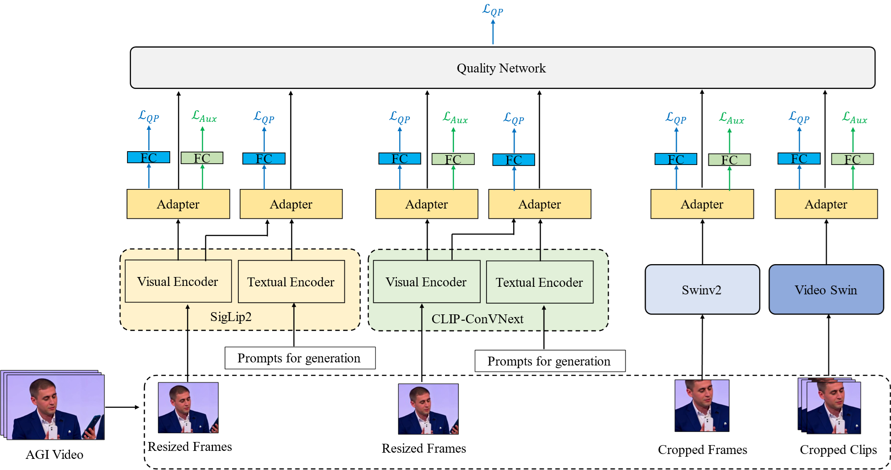

# A Cocktail Model for AI Generated VQA


## 1. Dependencies

```
torch>=2.5.1
torchvision
decord
open_clip_torch
transformers
einops
timm
```

## 2. model state dict
We provide trained model parameters (state_dict) at Baidu NetDisk:
 https://pan.baidu.com/s/15Tro5dFdFx0DttMrMGPh0g?pwd=bjet code: bjet 

## Trian model
See train.py to train model.

## Test model
For each video, we randomly selected 8 consecutive frames from each
video. The testing process was repeated 5 times, and the final quality
prediction for the video was obtained by averaging the results of these
5 runs.  
1. See Test.py to get the rsults of 5 runs.


2. See make_output.py to average the results of these
5 runs, and get the output.json


The dir ./results/results contains results of 5 runs.
The file ./results/output.json is the final (averaged) quality scores of each video.
